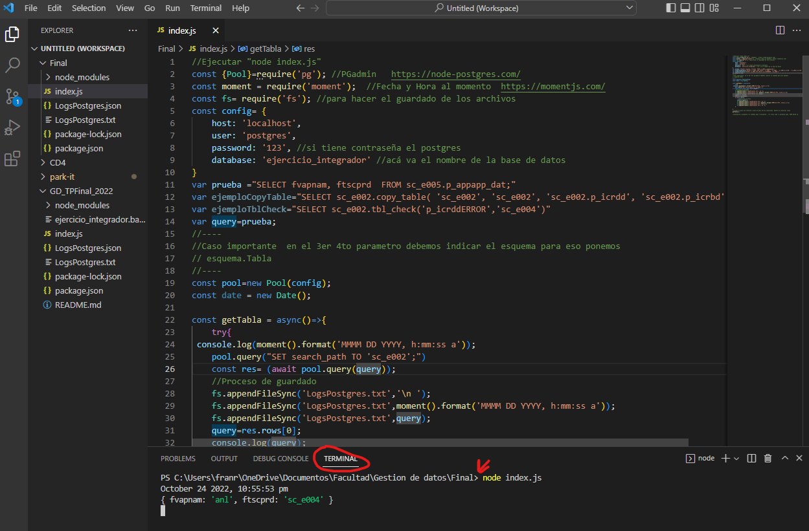

# LOG DE QUEARYS (TP INTEGRADOR)
Es una conexión basica con nodeJS y PostgresSQL. En donde le mandamos guarda un log de las consultas a la base de datos y nos envía la respuesta en la consulta en consola.
<div align="center">
 
 </div>
### Pre-requisitos 📋

Necesitamos para correr este progama

```
NodeJS y NPM(https://www.cursosgis.com/como-instalar-node-js-y-npm-en-4-pasos/)
PostgresSQL 14>
Base de datos integrador 
(Opcional) Visual studio code
```
Nota: Se puede ejecutar via cmd o desde Visual studio que es mas practico para la redacción y ejecución.
### Configuración base de datos 🔩
Para configurar la conexión de nuestra base de datos con node nos dirigimos a <a href="https://github.com/Francisrjs/GD_TPFinal_2022/blob/main/index.js">Index.js</a> . En donde vamos a modificar las siguientes lineas, en donde es la misma configuración que tenemos en Pgadmin4
https://github.com/Francisrjs/GD_TPFinal_2022/blob/acf202a1d3a008a5588f6d63fa7e3aa4c40bdf7a/index.js#L5-L9
## Ejecutando las pruebas ⚙️
Ya configurado la conexión y teniendo restaurada la base de datos, vamos a ejecutar algunas pruebas. Nos dirigimos en la terminal o visual studio code en la parte terminal a la carpeta , en mi caso _C:\Users\franr\OneDrive\Documentos\Facultad\Gestion de datos\Final>_. 
Ejecutamos el siguiente comando _node index.js_

 

Deje algunas pruebas con la base de datos del integrador, en las cuales se pueden cambiando el queary

```
query=ejemploCopyTable;
```

y finalmente nos devuelve lo siguiente:

```ruby
October 24 2022, 11:03:58 pm
{ copy_table: true }
```
En donde todo esto se guarda todas nuestras consultas  en el archivo [LogsPostgres.txt](LogsPostgres.txt)


## Integrantes 🤓

* Facundo Barriola
* Francisco Ferreira
* Francis Rojas
* Lautaro Costa


Gracias!
